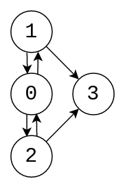

# Trabajo Práctico 2: La Fórmula Secreta

En este trabajo práctico, utilizaremos las herramientas estudiadas en clase para resolver problemas relacionados con el aprendizaje reforzado, el aprendizaje automático, la visión artificial y el procesamiento de lenguaje natural.

### Formato de entrega

Debe entregarse un Jupyter Notebook por cada ejercicio mediante un _PR_ (pull request) a este repositorio. El notebook debe haber sido ejecutado y contener los resultados de las ejecuciones. Debe estar dentro de una carpeta con su apellido dentro de la carpeta `entregas` y el nombre debe ser `TP2-RL.ipynb`, `TP2-ML.ipynb`, `TP2-CV.ipynb` y `TP2-NLP.ipynb` según corresponda. 

### Librerías externas
Está permitido el uso de Numpy, TQDM, Matplotlib, Seaborn, Pandas, Scikit-learn, Xgboost, Pytorch, Pytorch-lightning, Tensorflow, Keras y Gensim. Si desea utilizar alguna librería no mencionada, consulte con los docentes.

### Checkpoint
Se debe entregar al menos 2 ejercicios funcionando (aunque no estén en su versión terminada) para demostrar avance antes del domingo 26 de mayo a las 23:59 hs este _PR_ debe tener como título `Checkpoint APELLIDO`. Si no se cumpliera se restará entre 0 y 1 punto de la nota final.

### Entrega final
La fecha de entrega es el domingo 16 de junio a las 23:59 hs.

## Parte 1 Aprendizaje Reforzado: El laberinto del muffintaurio


Encuentre el mejor camino para llevar los muffins a la casa de la abuela. Debe pasar por el laberinto del muffintaurio, que es, convenientemente, un grafo dirigido.




### Reglas

#### Estado

- El estado es el nodo en el que estamos y la cantidad de muffins que llevamos `state = (nodo, muffins)`

#### Acciones

- Las acciones disponibles son ir a un nodo vecino conectado por una arista

#### Recompensa y transiciones

- Empezamos en el **nodo 0** con entre 1 y 10 muffins
- En el **nodo 1** vive el Conejo Blanco, que dado que es su no cumpleaños, no nos queda otra que compartir 2 muffins. `muffins -= 2`
- En el **nodo 2** nos venden 2 muffins por una moneda de oro. `reward = -1` `muffins += 2`
- Al llegar al **nodo 3** (la casa de la abuela), recibimos $6-|muffins-6|$ monedas de oro (no le gusta tirar comida). `reward = 6 - abs(muffins-6)`.
- Si nos quedamos sin muffins, perdemos todo el dia de trabajo y debemos pagar 42 monedas de oro. `reward = -42`
- Podemos cargar solo 10 muffins con nuestra cesta. `muffins = min(muffins, 10)`

#### Factor de descuento

- El factor de descuento es 0.9

### Instrucciones:

1. Programe el ambiente que simule el laberinto del muffintaurio, debe construir una función `step(state, action)` que reciba un estado y una acción, y que devuelva el estado siguiente y la recompensa. _nota: este ambiente es determinístico, por lo que la probabilidad de transición a un determinado s' es 1_

2. Encuentre la política optima usando **Value Iteration**, para esto lea el capítulo 4.4. del libro de Sutton y Barto e implemente el algoritmo. Use una tolerancia `tol = 0.1`

3. Imprima una tabla de nodo vs cantidad de muffins que muestre el valor de cada estado.

4. Imprima una tabla de nodo vs cantidad de muffins que muestre la política optima para cada estado.

5. Haga un análisis cualitativo de la política optima. ¿Tiene sentido?¿Es intuitiva?¿Es la que esperaba?

6. Mirando la tabla de valores, ¿Con cuantos muffins conviene empezar el dia?¿Depende del factor de descuento?

## Parte 2 Aprendizaje Automático: La fórmula secreta

Entrene un modelo de random forest o similar que dados los ingredientes de una receta diga si es para un muffin, cupcake o scone.

### Instrucciones:

1. Importe el dataset de `data/recetas_muffins_cupcakes_scones.csv` (puede agregar más datos si lo desea y compartirlos con sus compañeros; los números representan el volumen en cm³, normalizado a 100 cm³ por receta)
1. En un gráfico azúcar vs manteca, muestre los puntos del dataset de entrenamiento, con distintos colores para cada clase.
3. Separe los datos en train y validation (80%/20%)
3. Entrene un modelo que prediga si es un muffin, cupcake o scone.
4. Informe la accuracy del modelo en el dataset de entrenamiento y el de validación
5. Testee su modelo con el siguiente test set:

| Type    | Flour | Milk | Sugar | Butter | Egg | Baking Powder | Vanilla | Salt |
| ------- | ----- | ---- | ----- | ------ | --- | ------------- | ------- | ---- |
| muffin  | 50    | 16   | 19    | 8      | 6   | 0             | 0       | 1    |
| cupcake | 42    | 7    | 17    | 16     | 15  | 1             | 1       | 0    |
| scone   | 25    | 6    | 45    | 4      | 10  | 7             | 0       | 3    |

7. En un gráfico azúcar vs manteca, muestre las predicciones sobre el dataset de entrenamiento y el de testeo con distintos marcadores e indique con colores la clase que predice su modelo.
8. ¿Cree que su modelo está sobreajustando?
9. Encuentre la receta del muffin mas muffinesco, haciendo un promedio o con alguna otra técnica de su elección.
10. ~~Cocine su receta y traiga muffins para el resto de la clase.~~

## Parte 3 Visión Artificial: El muffinómetro

Entrene un modelo que, dada una imagen, determine si esta representa un muffin o un cupcake.

### Instrucciones:

1. Descomprima el dataset proporcionado en data/image_dataset.zip.
2. Separe los datos en train y validation (80%/20%).
3. Entrene un modelo usando la siguiente arquitectura (o similar):

```
8x conv2d 3x3
ReLU
maxpool 2x2
dropout 0.4

12x conv2d 3x3
ReLU
maxpool 2x2
dropout 0.4

flatten
1x dense
sigmoid
```

4. Grafique la curva de loss de entrenamiento y validación en función de la epoch. ¿Tiene la forma que esperaba?
5. Informe la accuracy en el dataset de entrenamiento y el de validación (el modelo debería lograr 80-85% de accuracy en el dataset de validación)
6. Testee su modelo buscando en internet una imagen de un muffin y una de un cupcake, (estas imágenes no deben estar en el dataset de entrenamiento).

## Parte 4 Procesamiento de Lenguaje: GPT-muffin

Utilice word2vec para desarrollar un sistema muy sencillo que, dado un texto, prediga si la última palabra puede ser reemplazada por 'muffin'. Para esto vamos a usar la librería [gensim](https://radimrehurek.com/gensim/models/word2vec.html) y el modelo pre-entrenado de google news 300.

### Instrucciones:

1. Cargue los pesos pre-entrenados de 'word2vec-google-news-300'. Puede obtenerlos usando gensim.downloader.load('word2vec-google-news-300') o descargándolos manualmente de otra fuente.
2. Cree una función que devuelva la similaridad entre la ultima palabra de una oración y la palabra "muffin" (*gensim* tiene muchos métodos que pueden ayudar).
3. Proponga e implemente un método para encontrar el umbral de similitud optimo.
4. Cree una función que devuelva 'True' si la última palabra de una oración puede ser reemplazada por 'muffin'.s
5. Testee su modelo con las siguientes oraciones:

- "I'm going to eat a tasty **cupcake**" -> True
- "I was driving my **car**" -> False
- "The tree is **green**" -> False
- "It was delicious to eat that **cake**" -> True
- "This is not arborio rice it is carnaroli **rice**" -> ?
- "Inside the box there was a **cat**" -> ?
- "Uhh, it's pronounced **bagel**" -> ?
- "t is the last letter of the word **croissant**" -> ?

6. ¿Qué piensa acerca de los casos con signo de interrogación? ¿Qué podría hacer para mejorar su modelo?
